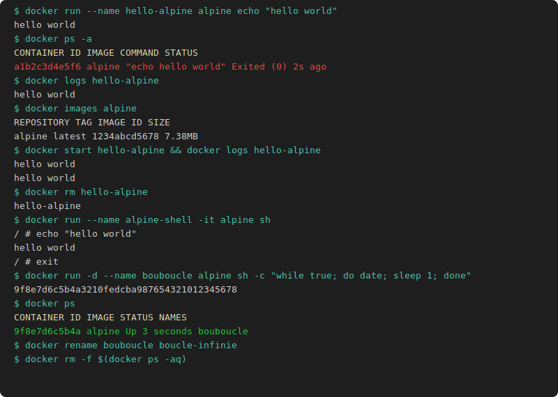

# TP1 Manipulation de conteneurs

## Affichage d'un message

```bash
docker run --name hello-alpine alpine echo "hello world"
docker ps -a
docker logs hello-alpine
docker images alpine
docker inspect hello-alpine
docker start hello-alpine
docker logs hello-alpine
docker rm hello-alpine
```

## Mode terminal

```bash
docker run --name alpine-shell -it alpine sh
# Dans le conteneur :
echo "hello world"
exit

docker ps -a
docker start alpine-shell
docker attach alpine-shell
# exit conteneur stopped

docker ps -a
docker start alpine-shell
docker exec -it alpine-shell sh
# exit conteneur reste Up

docker ps -a
```

## Boucle

```bash
docker run -d --name bouboucle alpine sh -c "while true; do date; sleep 1; done"
docker ps
docker rename bouboucle boucle-infinie
docker ps
docker stats boucle-infinie
docker attach boucle-infinie
# autre terminal :
docker logs -f boucle-infinie
docker run -d --name pingueur --link boucle-infinie:cible alpine sh -c "ping cible"
docker stop boucle-infinie pingueur
docker ps -aq
```

## Bonus

```bash
docker start boucle-infinie
docker inspect --format '{{.State.StartedAt}} | {{.Config.Image}} | {{range .Config.Cmd}}{{.}} {{end}}' boucle-infinie
docker rm -f $(docker ps -aq)
```


