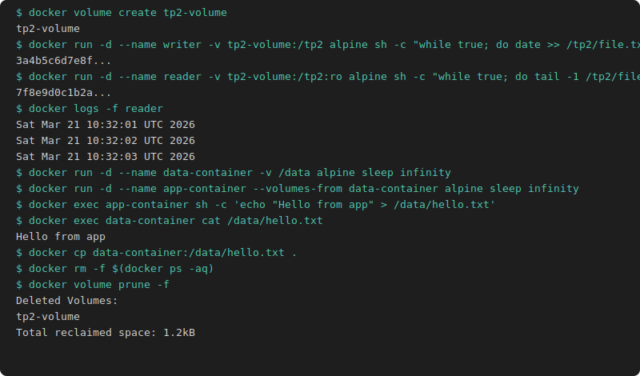

# TP2 Volumes

## Volume nommé

```bash
docker volume create tp2-volume

docker run -d --name writer \
  -v tp2-volume:/tp2 \
  alpine sh -c "while true; do date >> /tp2/file.txt; sleep 1; done"

docker run -d --name reader \
  -v tp2-volume:/tp2:ro \
  alpine sh -c "while true; do tail -1 /tp2/file.txt; sleep 1; done"

docker logs -f reader
```

## Bind mount

```bash
docker run -d --name binder \
  -v $(pwd)/host-file.txt:/data/file.txt \
  alpine sh -c "while true; do date >> /data/file.txt; sleep 1; done"

tail -f $(pwd)/host-file.txt
```

## Volumes-from

```bash
docker run -d --name data-container -v /data alpine sleep infinity

docker run -d --name app-container --volumes-from data-container alpine sleep infinity

docker exec app-container sh -c 'echo "Hello from app" > /data/hello.txt'
docker exec data-container cat /data/hello.txt
```

## docker cp

```bash
docker cp data-container:/data/hello.txt .
echo "Goodbye" > goodbye.txt
docker cp goodbye.txt data-container:/data/goodbye.txt
docker exec data-container ls /data/
```

## Nettoyage

```bash
docker rm -f $(docker ps -aq)
docker volume prune -f
```


