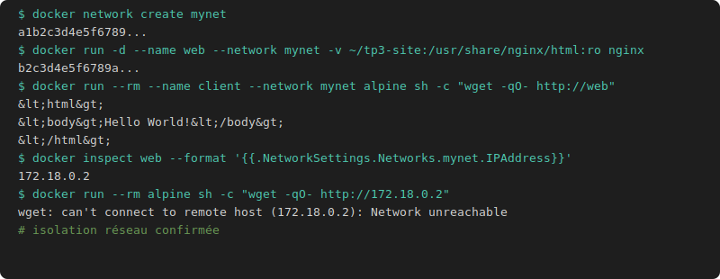

# TP3 Réseau

```bash
docker network create mynet

mkdir -p ~/tp3-site
cat > ~/tp3-site/index.html << 'EOF'
<html><body>Hello World!</body></html>
EOF

docker run -d --name web \
  --network mynet \
  -v ~/tp3-site:/usr/share/nginx/html:ro \
  nginx

# Conteneur dans le même réseau
docker run --rm --name client \
  --network mynet \
  alpine sh -c "wget -qO- http://web"

# Récupérer l'IP de nginx
docker inspect web --format '{{.NetworkSettings.Networks.mynet.IPAddress}}'

# Conteneur hors réseau connexion refusée
docker run --rm alpine sh -c "wget -qO- http://172.18.0.2"
```


