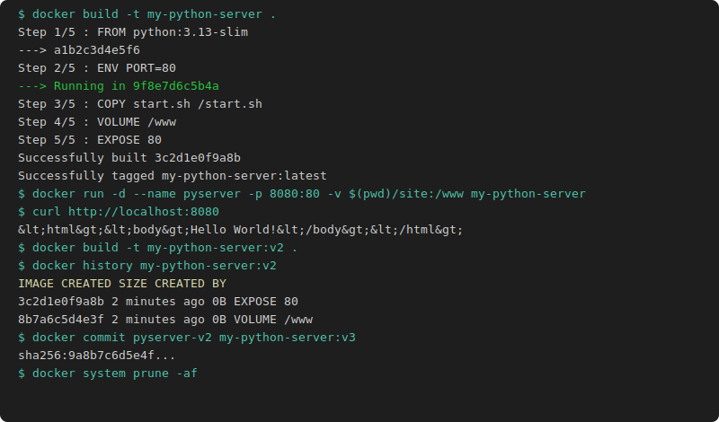

# TP4 Création d'image

## Mise en place

```bash
mkdir -p my-python-server/site && cd my-python-server

cat > start.sh << 'EOF'
#!/bin/sh
cd /www
echo "Démarrage du serveur sur le port $PORT"
python3 -m http.server $PORT
EOF
chmod +x start.sh

cat > site/index.html << 'EOF'
<html><body>Hello World!</body></html>
EOF
```

## Dockerfile

```dockerfile
FROM python:3.13-slim
ENV PORT=80
COPY start.sh /start.sh
VOLUME /www
ENTRYPOINT ["/start.sh"]
EXPOSE 80
```

```bash
docker build -t my-python-server .

docker run -d --name pyserver \
  -p 8080:80 \
  -v $(pwd)/site:/www \
  my-python-server

curl http://localhost:8080
```

## v2 et v3

```bash
# v2 via Dockerfile modifié
docker build -t my-python-server:v2 .
docker history my-python-server:v2

# v3 via docker commit
docker run -d --name pyserver-v2 -p 8081:80 -v $(pwd)/site:/www my-python-server:v2
docker exec pyserver-v2 sh -c 'echo "update" > /www/update.txt'
docker commit pyserver-v2 my-python-server:v3

docker run -d --name pyserver-v3 -p 8082:80 -v $(pwd)/site:/www my-python-server:v3
docker exec pyserver-v3 ls /www/
```

## Nettoyage

```bash
docker stop $(docker ps -q)
docker system prune -af
```


