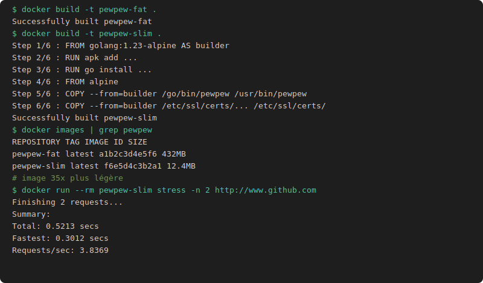

# TP5 Build multi-stage

## Stage unique (image lourde)

```dockerfile
FROM golang:1.23-alpine
RUN apk add -U --no-cache ca-certificates git sqlite-dev build-base
RUN go install github.com/bengadbois/pewpew@latest
ENTRYPOINT ["/go/bin/pewpew"]
```

```bash
docker build -t pewpew-fat .
docker run --rm pewpew-fat stress -n 2 http://www.google.fr
```

## Multi-stage (image légère)

```dockerfile
FROM golang:1.23-alpine AS builder
RUN apk add -U --no-cache ca-certificates git sqlite-dev build-base
RUN go install github.com/bengadbois/pewpew@latest

FROM alpine
COPY --from=builder /go/bin/pewpew /usr/bin/pewpew
COPY --from=builder /etc/ssl/certs/ca-certificates.crt /etc/ssl/certs/
ENTRYPOINT ["pewpew"]
```

```bash
docker build -t pewpew-slim .

# Comparaison des tailles
docker images | grep pewpew

docker run --rm pewpew-slim stress -n 2 http://www.github.com
```


