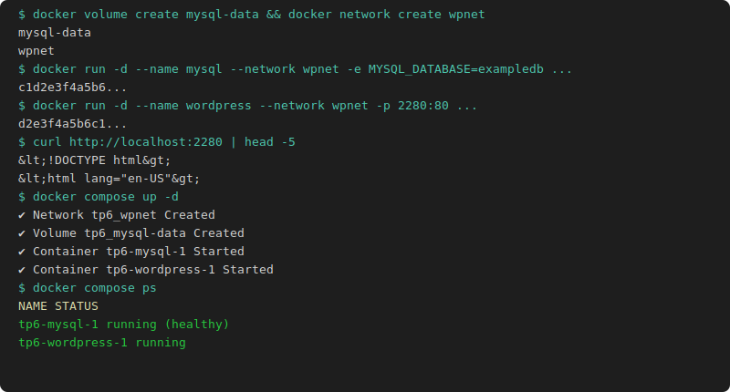

# TP6 WordPress

## Partie 1 : docker run

```bash
docker volume create mysql-data
docker network create wpnet

docker run -d --name mysql \
  --network wpnet \
  -e MYSQL_DATABASE=exampledb \
  -e MYSQL_USER=exampleuser \
  -e MYSQL_PASSWORD=examplepass \
  -e MYSQL_RANDOM_ROOT_PASSWORD=1 \
  -v mysql-data:/var/lib/mysql \
  mysql:8.4

docker run -d --name wordpress \
  --network wpnet \
  -e WORDPRESS_DB_PASSWORD=examplepass \
  -e WORDPRESS_DB_HOST=mysql \
  -e WORDPRESS_DB_USER=exampleuser \
  -e WORDPRESS_DB_NAME=exampledb \
  -p 2280:80 \
  wordpress:6.0-apache

curl http://localhost:2280
```

## Partie 2 : Docker Compose

```yaml
# compose.yaml
services:
  mysql:
    image: mysql:8.4
    networks:
      wpnet:
        aliases:
          - mysql
    volumes:
      - mysql-data:/var/lib/mysql
    environment:
      MYSQL_DATABASE: exampledb
      MYSQL_USER: exampleuser
      MYSQL_PASSWORD: examplepass
      MYSQL_RANDOM_ROOT_PASSWORD: "1"

  wordpress:
    image: wordpress:6.0-apache
    networks:
      - wpnet
    ports:
      - "2280:80"
    environment:
      WORDPRESS_DB_PASSWORD: examplepass
      WORDPRESS_DB_HOST: mysql
      WORDPRESS_DB_USER: exampleuser
      WORDPRESS_DB_NAME: exampledb
    depends_on:
      - mysql

networks:
  wpnet:
volumes:
  mysql-data:
```

```bash
docker compose up -d

docker exec -it $(docker ps -qf name=wordpress) \
  mysql -h mysql -u exampleuser -pexamplepass exampledb
```


